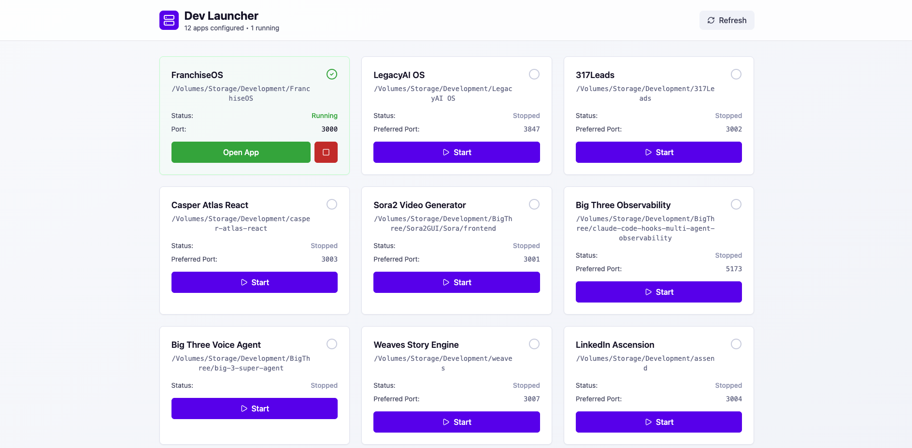

# Dev Launcher Framework

A flexible, reusable web-based application launcher for your development projects. Configure all your apps once and launch them with a single click.

## 📸 Dashboard Preview



## ✨ Features

- **One-click app launching** - Start/stop your development apps instantly
- **Automatic port management** - Smart port detection and conflict resolution
- **Mixed app support** - Web apps, CLI tools, Python scripts, Docker services
- **Click-to-open paths** - Click any folder path to open Terminal there
- **Professional UI** - Clean, modern interface with real-time status
- **Environment flexible** - Support for ~, env variables, relative/absolute paths
- **Configuration-driven** - Easy to customize and version control

## 🚀 Quick Start (3 minutes)

### 1. Install & Setup
```bash
cd dev-launcher

# Install dependencies
npm install

# Run setup wizard (creates your config)
npm run setup
```

### 2. Add Your Apps
Edit `backend/apps.local.js`:
```javascript
export const USER_APPS = [
  {
    id: 'my-app',
    name: 'My Next.js Project',
    path: '~/projects/my-app',
    command: 'npm',
    args: ['run', 'dev'],
    preferredPort: 3000,
    maxPort: 3010,
    autoOpenBrowser: true,
    type: 'nextjs'
  }
];
```

### 3. Launch & Start
```bash
# Simple startup (recommended)
./start.sh

# Manual startup
cd backend && npm start
cd frontend && npm run dev # in another terminal
```

### 4. Use Your Launcher
Open http://localhost:4501 to see and launch all your apps!

## 📁 Project Structure

```
dev-launcher/
├── backend/
│   ├── server.js              # Express API server
│   ├── apps.js                # Dynamic app configurations
│   ├── apps.local.js          # YOUR personal apps (gitignored)
│   ├── apps-template.js       # Configuration examples
│   ├── apps.defaults.js       # Built-in fallbacks
│   ├── config-utils.js        # Path resolution & utilities
│   └── package.json
├── frontend/
│   └── src/                   # React UI components
├── scripts/
│   └── setup.js               # Interactive setup wizard
├── docs/
│   ├── SETUP.md               # Setup guide
│   ├── CONFIGURATION.md      # Configuration reference
│   └── EXAMPLES.md           # Usage examples
├── .env.example              # Environment template
└── .gitignore                # Properly ignores personal configs
```

## ⚙️ Configuration

### Simple App Configuration
```javascript
// apps.local.js
export const USER_APPS = [
  // Next.js app
  {
    id: 'blog',
    name: 'My Blog',
    path: '~/projects/blog',
    command: 'npm',
    args: ['run', 'dev'],
    preferredPort: 3000,
    type: 'nextjs'
  },

  // Python CLI tool
  {
    id: 'data-scraper',
    name: 'Web Scraper',
    path: '${DEV_ROOT}/tools/scraper',
    command: 'python',
    args: ['main.py'],
    preferredPort: null, // No web interface
    autoOpenBrowser: false,
    type: 'python-cli'
  }
];
```

### Environment Variables
```env
# .env (create from .env.example)
DEV_ROOT=~/projects                    # Base directory
BROWSER_APP=Google Chrome              # Browser preference
TERMINAL_APP=Terminal.app             # Terminal preference
MAX_PORT_ATTEMPTS=10                   # Port conflict handling
```

### Supported App Types
| Type | Example Command | Typical Port |
|------|----------------|--------------|
| `nextjs` | `npm run dev` | 3000 |
| `vite` | `npm run dev` | 5173 |
| `python` | `python app.py` | 8000 |
| `python-cli` | `python script.py` | None |
| `static` | `python -m http.server` | 4000 |
| `docker` | `docker-compose up` | Varies |

## 🔧 Advanced Features

### Path Flexibility
- **Tilde**: `~/projects/my-app` → expands to home
- **Environment**: `${DEV_ROOT}/my-app` → uses env vars
- **Absolute**: `/Users/name/projects/my-app`
- **Relative**: `../projects/my-app`

### Smart Port Management
- Auto-detects available ports
- Handles port conflicts gracefully
- Shows assigned ports in real-time
- Port range configuration per app

### Process Management
- Clean process lifecycle management
- Status monitoring with visual indicators
- Stop running apps with one click
- Automatic cleanup on shutdown

### Click-to-Open Paths
For any app, click its folder path to instantly open a new Terminal window at that location.

### Environment Integration
```bash
# Setup new environment automatically
cd backend && npm run setup

# Validate your configuration
npm run validate

# Refresh configurations without restart
# POST /api/config/refresh in browser console
```

## 📚 Documentation

- **[Setup Guide](docs/SETUP.md)** - Complete setup instructions
- **[Configuration Reference](docs/CONFIGURATION.md)** - All configuration options
- **[Examples](docs/EXAMPLES.md)** - Common configuration patterns

## 🛠️ Development

### API Endpoints
- `GET /api/apps` - List all apps with status
- `GET /api/status` - System status overview
- `POST /api/apps/:id/start` - Start an application
- `POST /api/apps/:id/stop` - Stop an application
- `POST /api/apps/:id/open-terminal` - Open Terminal at path
- `POST /api/config/refresh` - Reload configurations
- `GET /api/config/validate` - Validate app configs
- `GET /api/setup` - Run setup wizard

### Contributing
1. Fork the repository
2. Create a feature branch
3. Add tests for new functionality
4. Submit a pull request

## 🎯 Use Cases

### Web Development
```javascript
{
  id: 'frontend',
  name: 'React Dashboard',
  path: '~/projects/dashboard',
  command: 'npm',
  args: ['start'],
  preferredPort: 3000,
  type: 'cra'
}
```

### Backend Services
```javascript
{
  id: 'api',
  name: 'Python API',
  path: '${DEV_ROOT}/api-server',
  command: 'uvicorn',
  args: ['main:app', '--reload'],
  preferredPort: 8000,
  type: 'python'
}
```

### Development Tools
```javascript
{
  id: 'tailwind-watch',
  name: 'Tailwind CSS Compiler',
  path: '~/projects/design-system',
  command: 'npm',
  args: ['run', 'css:watch'],
  preferredPort: null,
  autoOpenBrowser: false,
  type: 'cli'
}
```

### Docker Services
```javascript
{
  id: 'database',
  name: 'PostgreSQL with Docker',
  path: '~/projects/docker-setup',
  command: 'docker-compose',
  args: ['up', '-d', 'postgres'],
  preferredPort: 5432,
  type: 'docker'
}
```

## 🔄 Migration

Upgrade from older versions:
```bash
# Your apps are preserved in apps.local.js
# Update paths to use ~ or environment variables
# Add project types for better organization
# Check: docs/CONFIGURATION.md for migration tips
```

## 🤝 Support

- **Issues**: Report bugs in GitHub Issues
- **Feature Requests**: Discuss in Discussions
- **Questions**: Check docs/CONFIGURATION.md first

## 📄 License

MIT License - Feel free to use in personal and commercial projects!

---

**Ready to organize your development workflow?** 

`git clone <this-repo>` → `npm install` → `npm run setup` → `./start.sh` → ✨

Your personalized development launcher is ready! 🚀
